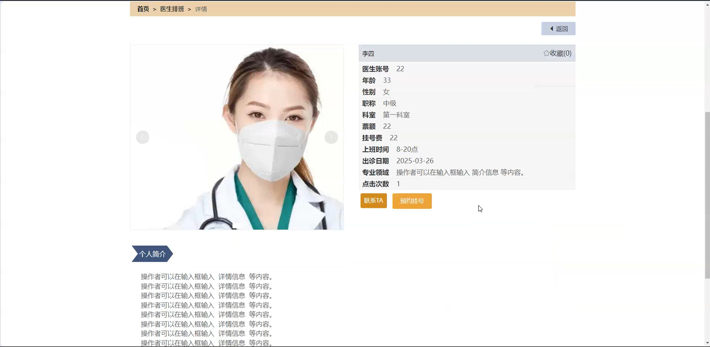
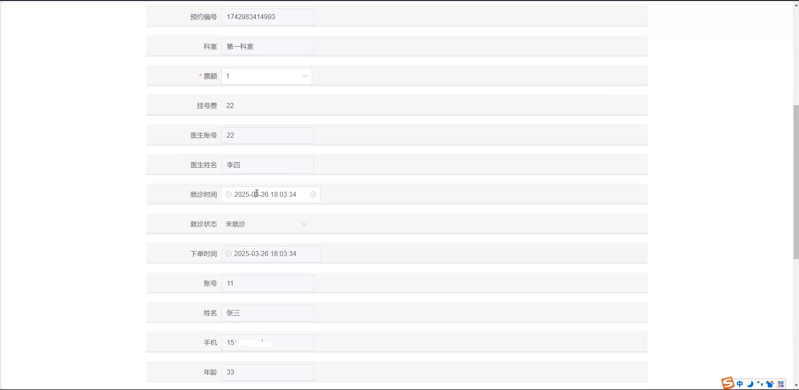
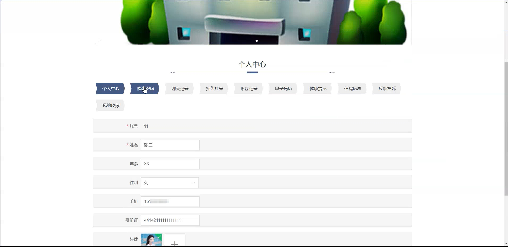
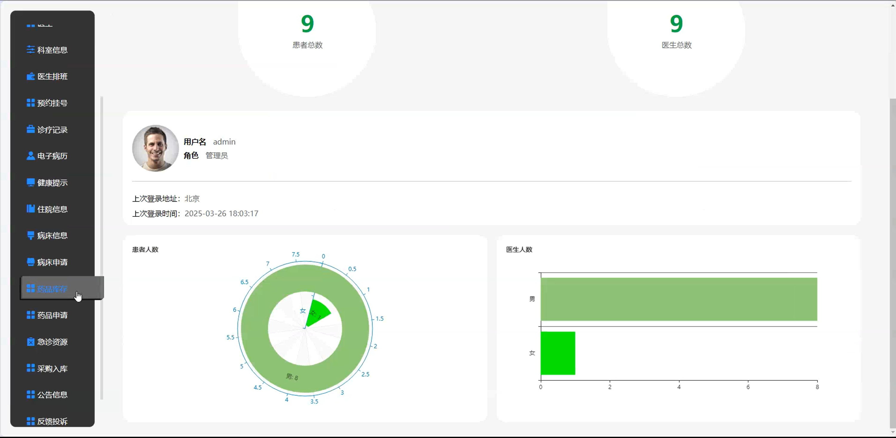
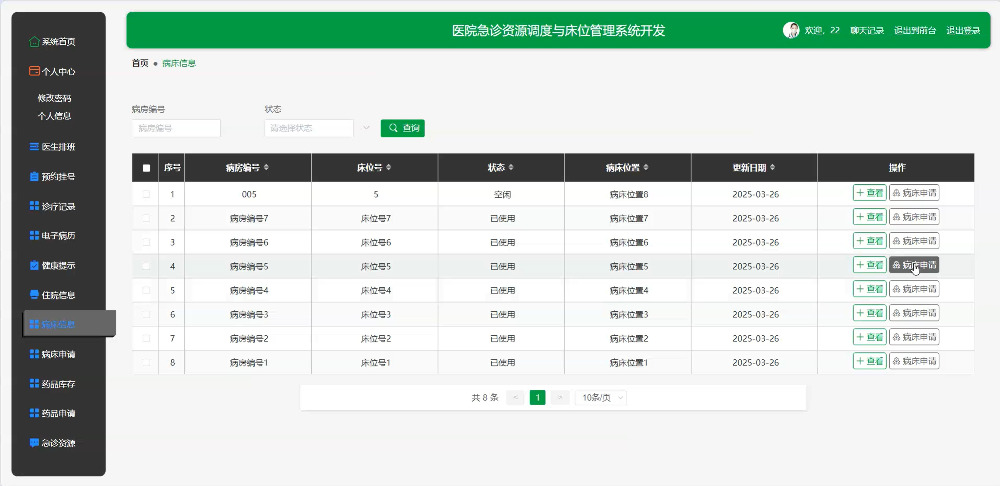
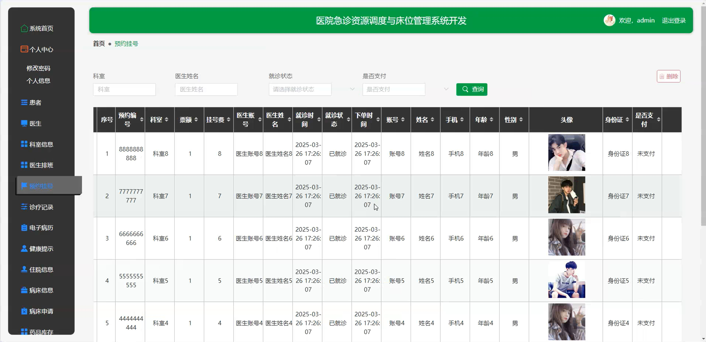
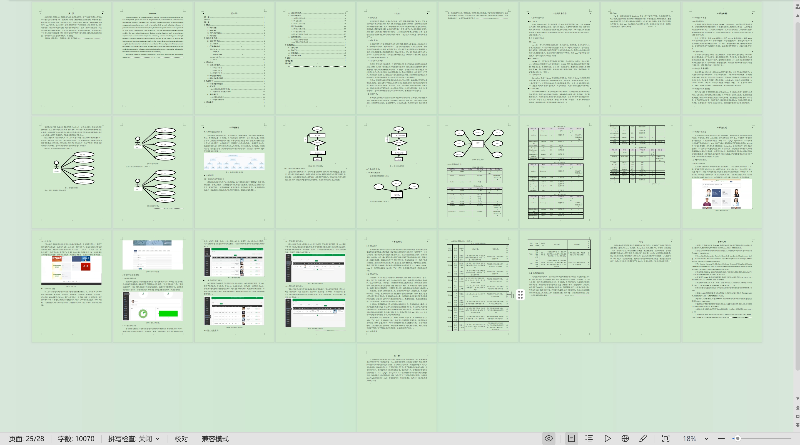

# springbootA517D
springbootA517D医院急诊资源调度与床位管理系统+LW
## 查看主页获取源码

### 一、关键词

医生排班、预约挂号、诊疗记录

### 二、作品包含

源码+数据库+设计文档万字+全套环境和工具资源+本地部署教程

### 三、项目技术

前端技术：Html、Css、Js、Vue2.0、Element-ui 
后端技术：Java、SpringBoot2.0、MyBatis

### 四、运行环境（以下版本亲测，其他版本未知，请自测）

开发工具：IDEA/eclipse  + VSCODE

数据库：MySQL5.7（最低要5.7版本）

数据库管理工具：Navicat10以上版本

环境配置软件： JDK1.8 + Maven3.6.3

前端Nodejs：14

浏览器：谷歌浏览器

### 五、项目介绍

项目编号：springbootA517D

医院急诊资源调度与床位管理系统可实时优化急诊人力、设备等资源调配及床位分配，提升急诊救治效率与患者流转速度。

角色：管理员、用户、医生

用户功能：首页、医生排班、公告信息、个人中心、修改密码、聊天记录、预约挂号、诊疗记录、电子病历、健康提示、住院信息、反馈投诉、我的收藏。

管理员功能：系统首页、个人中心、患者、医生、科室信息、医生排班、预约挂号、诊疗记录、电子病历、健康提示、住院信息、病床信息、病床申请、药品库存、药品申请、急诊资源、采购入库、公告信息、反馈投诉、轮播图管理。

医生功能：系统首页、个人中心、医生排班、预约挂号、诊疗记录、电子病历、健康提示、住院信息、病床信息、病床申请、药品库存、药品申请、急诊资源。

### 六、运行截图

